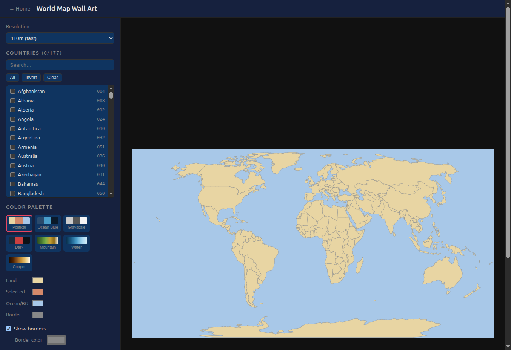
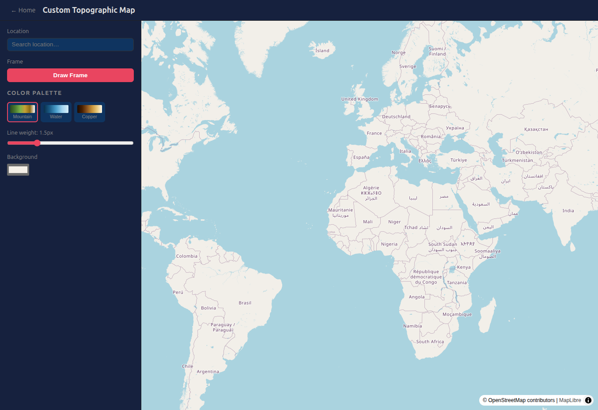

# Map Design Tools

**Status**: MVP | **Mode**: Claude Code | **Updated**: 2026-03-24

Two browser-based tools for generating wall-art-quality map outputs -- no backend, no API keys, runs entirely in your browser.

**Live site**: [https://k1monfared.github.io/map_design/](https://k1monfared.github.io/map_design/)
**Source**: [https://github.com/k1monfared/map_design](https://github.com/k1monfared/map_design)

---

## What This Project Does

Map Design Tools is a static web application for creating print-ready maps. It provides two distinct tools:

1. **World Map Wall Art** -- Select countries on a world map, customize colors with palette presets or individual overrides, toggle borders, overlay an elevation/bathymetry backdrop, and export at print resolution in vector or raster formats.

2. **Custom Topographic Map** -- Search any location on Earth, draw a bounding box on an interactive map, and generate contour-line art from real elevation data. Adjust the number of contour levels, tweak individual thresholds with sliders, pick a color gradient, and export for printing or CNC/laser cutting.

Everything runs client-side in the browser. There is no server, no login, and no API keys required.

---

## Screenshots

### World Map Wall Art



Select and highlight countries, choose from 7 palette presets (Political, Ocean Blue, Grayscale, Dark, Mountain, Water, Copper), customize individual colors for land, selected regions, ocean/background, and borders, and export at any resolution.

### Custom Topographic Map



Search any location via OpenStreetMap Nominatim, draw a bounding box on the MapLibre GL JS map, then generate contour art from real elevation data fetched from AWS Terrarium tiles.

---

## Features

### World Map Wall Art
- Click countries directly on the SVG map or search/select from an alphabetical list
- Bulk actions: Select All, Invert Selection, Clear
- Two map resolutions: 110m (fast) and 50m (detailed), sourced from Natural Earth TopoJSON
- 7 built-in color palette presets (4 categorical, 3 gradient)
- Per-color overrides for land, selected, ocean/background, and border colors
- Toggle country borders on/off with customizable border color
- Optional elevation/bathymetry backdrop rendered from AWS Terrarium tiles
- Export to SVG, PDF, PNG, or TIFF with configurable DPI and physical size (inches or cm)

### Custom Topographic Map
- Location search powered by Nominatim (OpenStreetMap)
- Interactive map powered by MapLibre GL JS with OpenStreetMap raster tiles
- Draw a bounding box by clicking two corners on the map
- Elevation data fetched from AWS Terrarium tiles, supplemented by NOAA ETOPO1 for lake bathymetry
- Contour generation via d3-contour with adjustable number of levels (2--20)
- Per-level threshold sliders for fine-tuning contour positions
- 3 gradient palette presets (Mountain, Water, Copper)
- Adjustable line weight (0.5--5px)
- Customizable background color
- Export to SVG, PDF, PNG, or TIFF
- CNC/laser-cutter export: downloads a ZIP file containing one SVG per contour level

### Shared Features
- Permanent links: all configuration is encoded in the URL hash (base64url JSON) -- copy the URL and the exact map state is restored in any browser
- Dark theme UI with a left-panel / right-canvas layout
- Fully client-side: no backend, no login, no API keys

---

## Technologies

| Technology | Purpose |
|---|---|
| [Svelte 4](https://svelte.dev/) | Reactive UI framework |
| [Vite 5](https://vitejs.dev/) | Build tool and dev server |
| [d3-geo](https://github.com/d3/d3-geo) | Geographic projections (Natural Earth) and path rendering |
| [d3-contour](https://github.com/d3/d3-contour) | Contour/isoline generation from elevation grids |
| [topojson-client](https://github.com/topojson/topojson-client) | Decoding Natural Earth TopoJSON country boundaries |
| [MapLibre GL JS 4](https://maplibre.org/) | Interactive slippy map for location browsing and bounding box drawing |
| [jsPDF](https://github.com/parallax/jsPDF) + [svg2pdf.js](https://github.com/yWorks/svg2pdf.js) | Vector PDF export |
| [UTIF](https://github.com/nicjansma/utif.js) | TIFF raster export |
| [JSZip](https://stuk.github.io/jszip/) | ZIP packaging for CNC layer export |
| [GeoTIFF.js](https://geotiffjs.github.io/) | Decoding NOAA ETOPO1 GeoTIFF responses |

---

## Data Sources

| Data | Source | Notes |
|---|---|---|
| Country borders | [Natural Earth](https://www.naturalearthdata.com/) (TopoJSON) | Bundled at 110m and 50m resolutions |
| Land/ocean elevation | [AWS Terrarium tiles](https://registry.opendata.aws/terrain-tiles/) | Free, no API key |
| Lake bathymetry | [NOAA ETOPO1 ImageServer](https://www.ncei.noaa.gov/products/etopo-global-relief-model) | Free, no API key; large lakes only |
| Location search | [Nominatim](https://nominatim.openstreetmap.org/) (OpenStreetMap) | Free, no API key |
| Map tiles | [OpenStreetMap](https://www.openstreetmap.org/) | Free raster tiles |

---

## Project Structure

```
map_design/
  index.html                          Entry point
  package.json                        Dependencies and scripts
  vite.config.js                      Vite config (base path, build output)
  svelte.config.js                    Svelte preprocessor config
  dev.sh                              Start dev server (installs deps if needed)
  build.sh                            Production build to dist/
  preview.sh                          Build and serve production output locally
  public/
    data/
      world-110m.json                 Natural Earth 110m TopoJSON
      world-50m.json                  Natural Earth 50m TopoJSON
  src/
    main.js                           App entry point
    App.svelte                        Hash-based router (Home, WorldMap, TopoMap)
    app.css                           Global CSS variables and reset
    pages/
      Home.svelte                     Landing page with tool cards
      WorldMap.svelte                 Tool 1: World Map Wall Art
      TopoMap.svelte                  Tool 2: Custom Topographic Map
    components/
      ColorPicker.svelte              Palette selector with custom color overrides
      ContourControls.svelte          N-level slider and per-level threshold sliders
      ExportPanel.svelte              Format/size/DPI selector and download button
      RegionSelector.svelte           Searchable country list with bulk actions
    lib/
      elevation.js                    Terrarium tile fetch + NOAA ETOPO1 fetch + grid merge
      export.js                       SVG, PDF, PNG, TIFF export functions
      palettes.js                     7 palette presets + gradient interpolation
      state.js                        URL hash state encode/decode (base64url JSON)
  .github/
    workflows/
      deploy.yml                      GitHub Actions: build and deploy to gh-pages
```

---

## Getting Started

### Prerequisites

- [Node.js](https://nodejs.org/) (v18 or later recommended)
- npm (comes with Node.js)

### Clone and Run

```bash
git clone git@github.com:k1monfared/map_design.git
cd map_design
./dev.sh
```

This installs dependencies (if not already present) and starts the Vite dev server at **http://localhost:5173/map_design/**.

### Build for Production

```bash
./build.sh
```

Output goes to `dist/`. The build is a fully static site that can be served from any web server or CDN.

### Preview Production Build

```bash
./preview.sh
```

Builds and serves the production output at **http://localhost:4173/map_design/**.

### Manual Commands

If you prefer not to use the shell scripts:

```bash
npm install          # Install dependencies
npm run dev          # Start dev server
npm run build        # Production build
npm run preview      # Serve production build
```

---

## Deployment

The project deploys automatically to GitHub Pages via GitHub Actions. Every push to the `master` branch triggers:

1. `npm ci` -- install dependencies
2. `npm run build` -- Vite production build
3. Deploy `dist/` to the `gh-pages` branch via [peaceiris/actions-gh-pages](https://github.com/peaceiris/actions-gh-pages)

The live site is available at [https://k1monfared.github.io/map_design/](https://k1monfared.github.io/map_design/).

---

## Export Formats

| Format | Type | Use Case |
|---|---|---|
| SVG | Vector | Scalable graphics for Illustrator, Inkscape, or web embedding |
| PDF | Vector | Print-ready document, opens in any PDF viewer |
| PNG | Raster | User-specified DPI and physical size (inches or cm) |
| TIFF | Raster | Compatible with professional print workflows |
| ZIP (CNC) | Vector bundle | One SVG per contour level, for laser cutters or CNC machines (topo map only) |

For raster formats (PNG, TIFF), you can configure DPI (72--1200) and physical dimensions. The tool warns before generating extremely large outputs (over 100 megapixels).

---

## How It Works

### World Map Tool
1. Country boundaries are loaded from bundled Natural Earth TopoJSON (110m or 50m resolution).
2. Countries are rendered as SVG paths using a d3 Natural Earth projection.
3. Clicking a country or toggling its checkbox highlights it with the "selected" color.
4. An optional elevation backdrop is fetched from AWS Terrarium tiles, decoded from RGB to meters, color-mapped, and rendered as a raster image behind the SVG paths.
5. Export clones the SVG DOM, optionally rasterizes it to a canvas at the target DPI, and triggers a download.

### Topographic Map Tool
1. The user searches a location (Nominatim geocoding) and navigates on a MapLibre GL JS interactive map.
2. The user draws a bounding box by clicking two corners.
3. Elevation tiles covering the bounding box are fetched from AWS Terrarium (primary) and optionally NOAA ETOPO1 (supplemental lake bathymetry), decoded, assembled into a grid, and bilinearly interpolated to the target resolution.
4. d3-contour generates isolines at the specified threshold levels.
5. Contour polygons are transformed from grid coordinates to geographic coordinates, then projected to SVG pixel coordinates.
6. Each contour level is color-mapped using gradient interpolation across the selected palette.
7. CNC export packages each contour level as a separate SVG file inside a ZIP archive.

### State Persistence
All tool state (selected countries, palette, bbox, contour levels, etc.) is serialized to JSON, base64url-encoded, and stored in the URL hash. Sharing the URL reproduces the exact map configuration.

---

## Known Limitations

- No visual rectangle overlay is drawn on the MapLibre map while defining the bounding box (a text hint is shown instead).
- Small lakes (under ~5 km) show a flat surface because GLOBathy data is not yet integrated.
- The contour label toggle (`showLabels`) is implemented but may need polish.
- Browser canvas size limits (~16384px per side) constrain maximum raster export dimensions.

---

## Documentation

| File | Description |
|---|---|
| `STATUS.log` | Project status and milestone tracking (loglog format) |
| `CLAUDE.md` | Development conventions and Claude Code instructions |

---

## License

This project does not currently include a license file. All data sources used (Natural Earth, OpenStreetMap, AWS Terrarium, NOAA ETOPO1) are freely available with no API key required.
